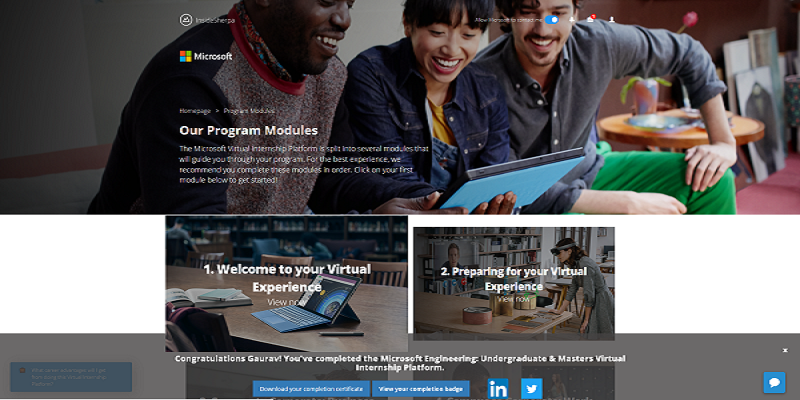

<h2>Engineering: Undergraduate & Masters Virtual Internship</h2>

<h4>My work in this Engineering: Undergraduate & Masters Virtual Internship Platform: </h4>
<ol>
    <li>
        Undertake research to discover more about Microsoft
    </li>
    <li>
        Prepare for your Virtual Internship experience at Microsoft
    </li>
    <li>
        Use SMART goal setting to build the career you want
    </li>
    <li>
        Get to know Microsoft’s values – Respect, Integrity and Accountability
    </li>
    <li>
        Explore Microsoft’s commitment and approach to putting values into action
    </li>
    <li>
        Explore Microsoft’s cultural transformation
    </li>
    <li>
        Discover Microsoft’s Four Solutions that enable digital transformation
    </li>
    <li>
        Bring your professional voice to the Microsoft table
    </li>
    <li>
        Bring a professional approach to meetings
    </li>
    <li>
        Discover the importance of your personal brand
    </li>
    <li>
        Realize the impact of a positive first impression
    </li>
    <li>
        Discover the value of applying a Growth Mindset to everything you do
    </li>
    <li>
        Learn the value of positive self-talk (bonus task)
    </li>
    <li>
        Discover the value of different types of learning activities (bonus task)
    </li>
    <li>
        Learn about managing your growth mindset and behavior to improve adaptability (bonus task)
    </li>
    <li>
        Learn about reactions to change and effective change management strategies (bonus task)
    </li>
    <li>
        Learn about different communication preferences to develop a more flexible communication style (bonus task)
    </li>
    <li>
        Adapt your communication style to support different communication preferences (bonus task)
    </li>
    <li>
        Learn how to manage your time and identify priorities more effectively (bonus task)
    </li>
    <li>
        Keep focused by developing strategies to manage disruptions (bonus task)
    </li>
    <li>
        Learn how Microsoft Azure is leading the way in helping organizations meet their business challenges
    </li>
</ol>
